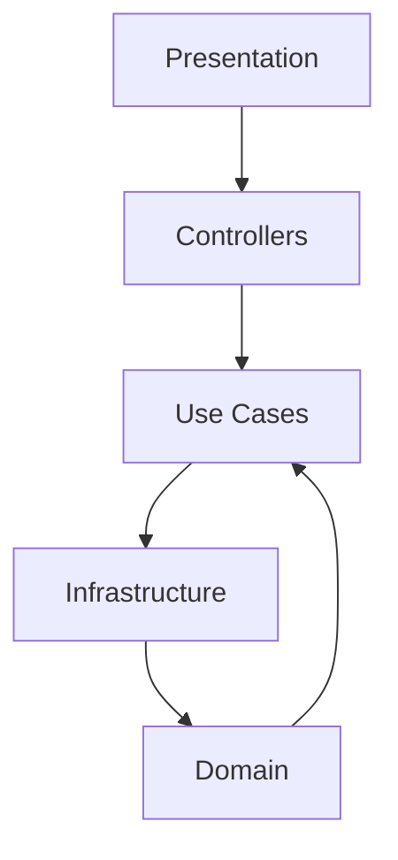

# Project Architecture Documentation

## Layer Architecture Diagram

# Architecture Overview

## Layers

1. **Presentation**: React components (Atomic Design)
2. **Controllers**: Route handlers and server actions
3. **Use Cases**: Business logic implementation
4. **Infrastructure**: Database implementations, external services
5. **Domain**: Business models and repository interfaces
