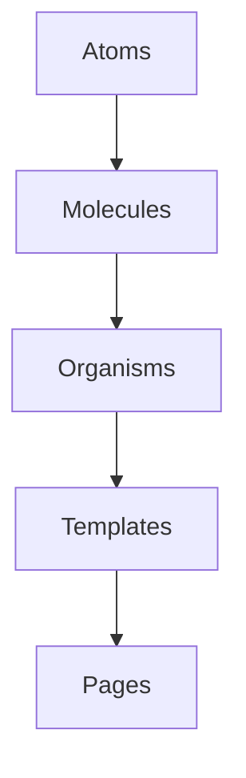

# Component Structure Diagram

# Component Structure

## Atomic Design Hierarchy

- Atoms: Basic UI elements (Buttons, Inputs)
- Molecules: Form components, search bars
- Organisms: Complex UI sections (Headers, Footers)
- Templates: Page layout structures
- Pages: Route-specific compositions
