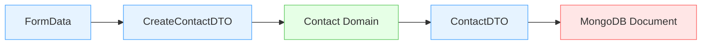

# Data Transformation Flow

```mermaid
graph LR
    A[FormData] --> B[CreateContactDTO]
    B --> C[Contact Domain]
    C --> D[ContactDTO]
    D --> E[MongoDB Document]

    classDef dto fill:#e6f3ff,stroke:#4da6ff;
    classDef domain fill:#e6ffe6,stroke:#66cc66;
    classDef persistence fill:#ffe6e6,stroke:#ff6666;

    class A,B,D,E dto;
    class C domain;
    class E persistence;
```
