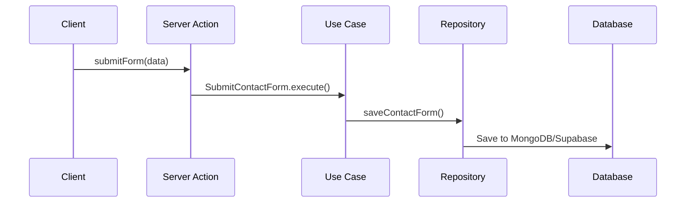

# Server Action Flow

```mermaid
sequenceDiagram
    Client->>Server Action: submitForm(data)
    Server Action->>Use Case: SubmitContactForm.execute()
    Use Case->>Repository: saveContactForm()
    Repository->>Database: Save to MongoDB/Supabase
```
